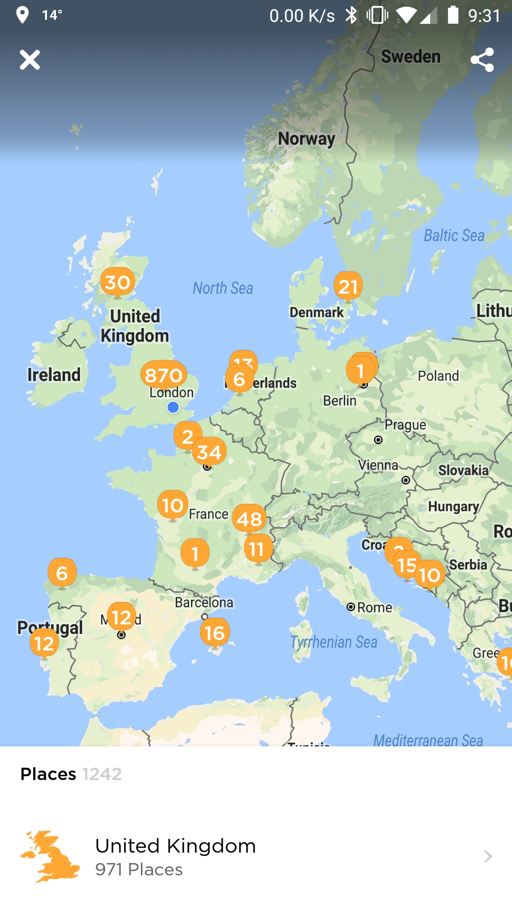

```{r setup, include=FALSE}
knitr::opts_chunk$set(message=FALSE, warning=FALSE, comment=FALSE, 
                      cache=TRUE, echo=TRUE, dpi=75, fig.retina=2, fig.align='center')
```

## Plan

Foursquare, split into two separate apps (Foursquare and Swarm) around 2014, is very likely the mobile app I use most. It is a geolocalized venue recommendation app helping us find the best venues around, and Swarm is the associated check-in app. They complement one other nicely, as your Swarm check-ins influence the Foursquare venue recommendations you get based on the sort of places you tend to visit more often and reviews you've given, among other factors.

So yes, I tend to use these two apps quite often ... in fact I do check-in to most places I go. First because it does improve the Foursquare venue tips I get when visiting new areas and new cities, second because it keeps track of all the places I have been to along the years, and I really enjoy taking a look back at where I had dinner a year ago, or how many times I have been to this pizza place ... my geek side, I guess.

And [apparently](https://medium.com/foursquare-direct/say-hello-to-the-new-swarm-5-0-1f18bdda28da) I am not alone: the Swarm development team realized it, called this behaviour **lifelogging** and re-designed their app around it. For example, here below is a snapshot of the Profile section in Swarm. A map presents all the different places I've checked into, which can be zoomed in for more details. 

<center>{ height=20%, width=20%}</center>

Places are presented as clusters to avoid data overplotting. To get to see all venues as points, you would have to zoom in aggressively until only a handful of streets remain visible on screen.

For the purpose of this post, I will use the same dataset (restricted to London) to create another kind of maps. I especially want to visualize how the areas I spend most of my time have evolved since 2013 when I started checking in.
For this, I will:

* Connect to the Foursquare API to retrieve all my visited places and associated coordinates.
* Connect to Google Maps API to obtain a base map layer, and draw it thanks to `ggmap`.
* Connect to [Mapbox](https://www.mapbox.com/) API to obtain a more personal map layer. I'll use a map theme I designed using Mapbox Studio (I recommend everyone to give it a try, it is quite impressive what is possible to do).
* Use `ggplot2` to overlay the checkins points onto the map, and `facet_wrap` to split it by year.

## Foursquare API
To connect to the Foursquare API, you need to set up a developer account, create a new app, obtain a client ID and a Secret Key and authenticate your calls. This could be done in 5-10 mins by following the instructions given in the [Getting Started](https://developer.foursquare.com/docs/api/getting-started) webpage. I have already done this so will skip this part: I have an ID, a Key, and a token to access my personal check-ins.

```{r, include=FALSE}
access_token <- read.table('~/Dev/Secret/fsq_token.txt',stringsAsFactors = FALSE)[1,1]
```

I have written a quick function to hit the API and get a data frame of checkins in return. This API call is detailed on the [Foursquare Development Portal](https://developer.foursquare.com/docs/api/users/checkins). Each call can only return 250 results. I have approximately 2000 checkins to retrieve so a loop is necessary.

```{r get_checkins}
library(tidyverse)

get_checkins <- function(access_token){
  version <- format(Sys.Date(), '%Y%m%d')
  limit <- 250
  offset <- 0 # Will be incremented at every iteration, by `limit`
  
  while(TRUE){
    url <- glue::glue("https://api.foursquare.com/v2/users/self/checkins?oauth_token={access_token}&v={version}&limit={limit}&offset={offset}")
    resp <- jsonlite::fromJSON(url, simplifyVector = T, flatten = T)
    items <- tibble::as_data_frame(resp$response$checkins$items)
    
    if(nrow(items) == 0) # No more check-ins to retrieve, exit loop
      break
    
    if(offset == 0){
      checkins <- items
    } else {
      checkins <- dplyr::bind_rows(checkins, items)
    }
    offset <- offset + limit
  }
  checkins
}
```

Let's call this function, and display the number of columns and rows of the returned data frame. It should be a rather wide one, so I won't display it here until tidied up.
```{r results='asis'}
checkins_raw <- get_checkins(access_token)
dim(checkins_raw)
```

Let's tidy up the dataset to select only the features we are interested in: check-in date, venue name, venue category, and coordinates. I am only interested in London check-ins so I will filter places based on their coordinates.
```{r results='asis'}
checkins <- checkins_raw %>%
  unnest(venue.categories) %>% #Unnesting makes venues with no categories dropped (https://github.com/tidyverse/tidyr/issues/358)
  right_join(checkins_raw) %>% #Reinsert those venues, with category attributes set to NA
  select(date = createdAt,
         venue = venue.name, 
         cat = name,
         lat = venue.location.lat, 
         lng = venue.location.lng) %>%
  mutate_at(vars(date), as.POSIXct, origin = '1970-01-01') %>% #Seconds since epoch to date
  mutate(year = lubridate::year(date)) %>%
  mutate(venue_trunc = stringr::str_trunc(venue, 20, ellipsis = '')) %>%
  filter(between(lng, -0.510375, 0.334016) & between(lat, 51.28676, 51.691874)) %>% # Only London
  arrange(date)

head(checkins) %>%
  knitr::kable(format = 'html', align = 'l') %>%
  kableExtra::kable_styling(bootstrap_options = 'striped', full_width = FALSE, position = 'left')
```

If we count the number of check-ins per year, we can see that apart from 2013 where I had only just started to check in, it has been pretty consistent over the years.
```{r}
dplyr::count(checkins, year) %>%
  tidyr::spread(year, n) %>%
  knitr::kable(format = 'html') %>%
  kableExtra::kable_styling(bootstrap_options = 'striped', full_width = FALSE, position = 'left')
```

Let's do a quick spatial plot to get started.
```{r}
ggplot() +
  geom_point(data = checkins, aes(lng, lat), size=0.2) 
```

Would be better with a base map layer... next section!

## Google Maps API
We'll use the `ggmap` package to hit Google Maps API and retrieve static base layers of London.
For this, we need to register for a Google developer account in order to receive a personal key.
Some information on how to get such a key is provided on the [`ggmap` Github page](https://github.com/dkahle/ggmap) or directly on the [relevant Google page](https://cloud.google.com/maps-platform/?hl=en).

```{r, include=FALSE}
google_key <- read.table('~/Dev/Secret/google_key.txt',stringsAsFactors = FALSE)[1,1]
```

```{r}
library(ggmap)
ggmap::register_google(key = google_key)

london <- c(lon = -0.118092, lat = 51.509865)
google_map <- ggmap::get_googlemap(london, 
                            zoom = 12, 
                            messaging = FALSE,
                            maptype = "roadmap")
```

```{r}
ggmap::ggmap(google_map, extent = 'device', maprange = TRUE) + 
  geom_point(data = checkins, aes(lng, lat), colour = '#ff4700', size=0.2) +
  labs(x = NULL, y = NULL, title = NULL)
```

## Mapbox API
Instead of the classic Google Maps theme, I want to use my own colours. For that, there is nothing easier than using another service provider: [Mapbox](https://www.mapbox.com/). I have been very impressed by how easy Mapbox makes it to create personalized maps: you can do pretty much everything with it! To use their service, you would need to create an account, and register a token. All of it can be done rather quickly.

```{r, include=FALSE}
mapbox_token <- read.table('~/Dev/Secret/mapbox_token.txt',stringsAsFactors = FALSE)[1,1]
```

`ggmap` does not support yet Mapbox so I had to create another function, called `get_mapbox_map`, and heavily inspired from `ggmap::get_googlemap`. This function is loaded from a separate file.

```{r}
source('~/Dev/R/fsq-checkins/mapbox_lib.R')
mapbox_map <- get_mapbox_map(london, 
                             token = mapbox_token,
                             size = c(1200,1000),
                             username = 'pierreange',
                             style_id = 'cji7htgkw2cgh2sqpnn6tbzda',
                             attribution = TRUE,
                             logo = TRUE,
                             zoom = 11.9)
```

Let's have a quick look at this base map alone. Isn't it better than the base Google Maps theme? :)
```{r}
ggmap::ggmap(mapbox_map, extent = 'device')
```

## Check-ins overlay
```{r, include=FALSE}
source('~/Dev/R/fsq-checkins/density_lib.R')
```

Let's now overlay the checkins coordinates on the Mapbox map. I decided to define the point colours based on the spatial density:
```{r}
checkins$density <- get_density(checkins$lng, checkins$lat, 20)
seq_palette <- c('#108188', '#339198', '#4CA2A8', '#62B4B9', '#79C5CA', '#8ED7DA', '#A3E9EC')

plot_points <- ggmap::ggmap(mapbox_map, extent = 'device') +
  geom_point(data = checkins, aes(lng, lat, alpha = density, colour = density), size=0.3) +
  labs(x = NULL, y = NULL, title = NULL) +
  scale_alpha(range = c(.2,.7), guide = FALSE) +
  scale_colour_gradientn(colours = rev(seq_palette), guide = FALSE)
plot_points
```


I now want to see the evolution along the years. Let's include a `facet_wrap` command:
```{r fig.height=8, fig.width=12}
plot_points_year <- plot_points +
  facet_wrap(~year) +
  theme(strip.background = element_rect(fill = NA, color = NA),
        strip.text = element_text(hjust = 0.5, colour = 'gray35', family = 'Palatino', size = 11, face = 'bold'),
        panel.spacing = unit(.1, 'cm'))
plot_points_year
```

We can see the different zones where I spend most of my time, and if concentrated enough we can distinguish the differences between the years. We could see it better by using density maps intead of points.

```{r fig.height=8, fig.width=12}
seq_palette_ext <- colorRampPalette(seq_palette) # Extend the range of colours

plot_pg <- ggmap::ggmap(mapbox_map, extent = 'device') +
  stat_density2d(data = checkins,
                 aes(x = lng, y = lat, fill = ..level.., alpha = ..level..),
                 n = 200, 
                 h = c(MASS::bandwidth.nrd(checkins$lng), 
                       MASS::bandwidth.nrd(checkins$lat)), 
                 geom = 'polygon') +
  scale_alpha(range = c(0,.5), trans = 'log', guide = FALSE)+
  scale_fill_gradientn(colours = seq_palette_ext(50), guide = FALSE)+
  theme(strip.background = element_rect(fill = NA, color = NA),
        strip.text = element_text(hjust = 0.5, colour = 'gray35', family = 'Palatino', size = 11, face = 'bold'),
        panel.spacing = unit(.1, 'cm')) +
  labs(title = NULL) +
  facet_wrap(~year)
plot_pg
```

Now the different areas are much more clearly displayed! 

I love it, because it tells a story, and a rather personal one. This is my story of London, and all those points bring me some memories. 

Looking at the maps, in all these years there is a common cluster of check-ins in Marylebone/Baker Street. This makes total sense, as this is where my office was until recently! Then a second cluster usually refers to my home: Angel in 2013/2014, Earls Court in 2015/2016, Hoxton in 2017/2018. In 2018 I changed job and my office is now near St Pauls: we can see the new cluster in the area.

## Conclusion
With this project, I learned how to connect to Foursquare, Google Maps and Mapbox API, and to create maps with a few lines of R, personalized with my own data and my own theme.